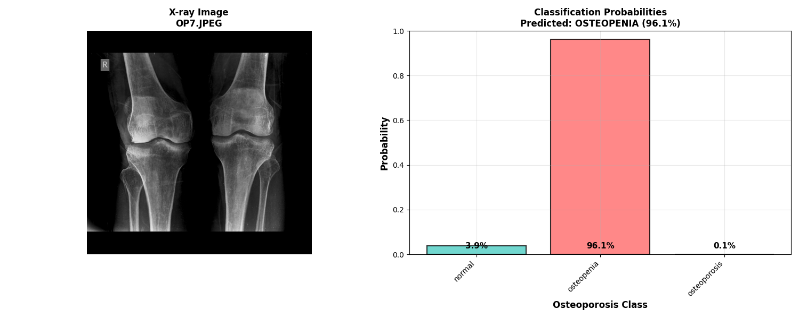
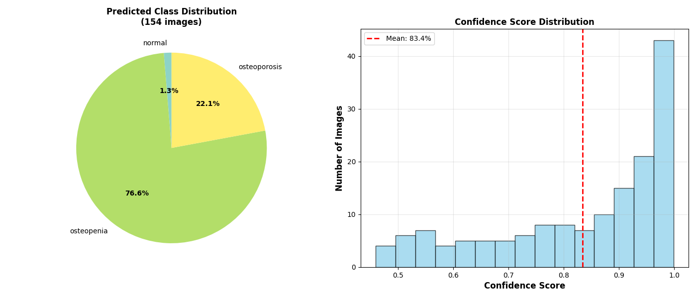
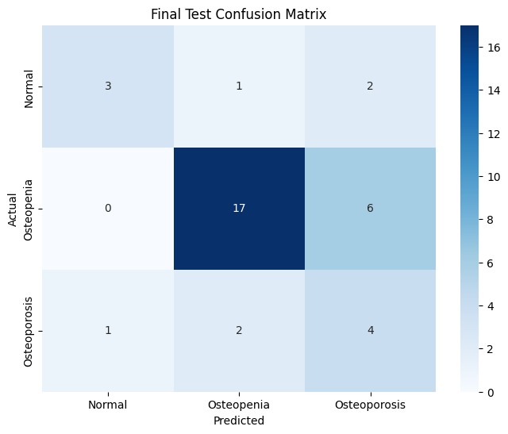

# Osteoporosis Classification from Knee X-rays

A deep learning project for classifying osteoporosis severity from knee X-ray images using PyTorch Lightning and EfficientNet.


## Setup

### 0. Environment Setup

First, create and activate a virtual environment, then install the required dependencies:

#### Using venv (recommended)
```bash
python -m venv osteo_env
source osteo_env/bin/activate
pip install -r requirements.txt
```

#### Using conda
```bash
conda create -n osteo_env python=3.9
conda activate osteo_env
pip install -r requirements.txt
```

### 1. Model Preparation

Run the setup script to automatically download and convert the model:

```bash
python setup.py
```

This will:
- Download the `.ckpt` weights from the GitHub releases page
- Convert them to `.onnx` format for optimized inference

### 2. Start Triton Server

Build and start the NVIDIA Triton server using Docker Compose:

```bash
docker compose up --build
```

This will launch the Triton inference server with the converted model ready for deployment.

## Inference

Use the Triton inference client for making predictions:

### Single Image Inference

```bash
python triton_inference.py --image test_image.jpg --visualize
```


### Batch Processing (Directory)

```bash
python triton_inference.py --dir test_folder --visualize
```
The `--visualize` flag enables visualization of the classification results.




## Requirements

- Docker with NVIDIA Container Runtime
- NVIDIA GPU with CUDA support
- Python 3.8+

## Overview

This project implements a computer vision model to automatically classify osteoporosis severity from knee X-ray images into three categories:
- **Normal**: Healthy bone density
- **Osteopenia**: Mild bone density loss (precursor to osteoporosis)
- **Osteoporosis**: Severe bone density loss

## Overall Metrics
- **Overall Accuracy**: 67%
- **Test Set Size**: 36 samples

### Per-Class Performance

| Class | Precision | Recall | F1-Score | Support |
|-------|-----------|--------|----------|---------|
| Normal | 0.75 | 0.50 | 0.60 | 6 |
| Osteopenia | 0.85 | 0.74 | 0.79 | 23 |
| Osteoporosis | 0.33 | 0.57 | 0.42 | 7 |



## Dataset

The project uses the [Osteoporosis Database](https://www.kaggle.com/datasets/mohamedgobara/osteoporosis-database/data) from Kaggle, which contains knee X-ray images labeled with osteoporosis severity levels.

**Dataset Statistics:**
- Normal: 36 images
- Osteopenia: 154 images  
- Osteoporosis: 49 images
- **Total**: 239 images

Features
- **Automatic balancing**: Uses oversampling to handle class imbalance
- TensorBoard logging

## Acknowledgments

- Dataset: [Mohamed Gobara's Osteoporosis Database](https://www.kaggle.com/datasets/mohamedgobara/osteoporosis-database)
- Model: EfficientNet architecture by Google Research
- Framework: PyTorch Lightning for streamlined training

